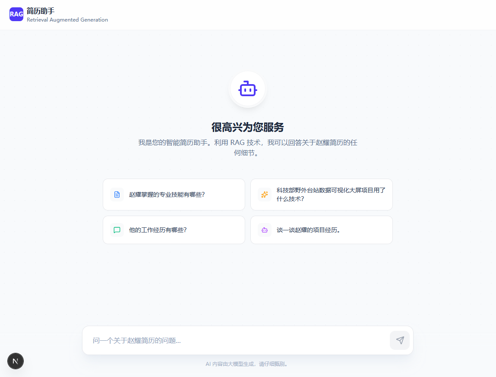
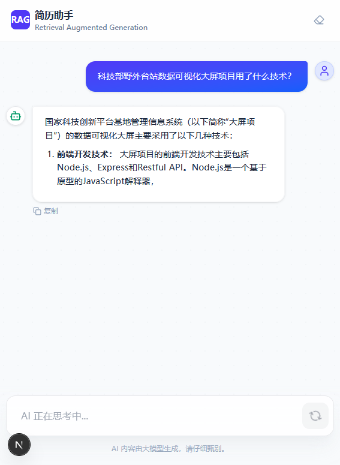

# MIPYao AI 简历助手

一个基于 RAG (检索增强生成) 技术的智能简历问答系统，使用 Next.js、NestJS 和 LangChain.js 构建。

## 📸 运行截图





## 🏗️ 项目架构

本项目采用 **Monorepo** 架构，使用 `pnpm workspace` 管理多个包和应用。

### 整体架构图

```
┌─────────────────────────────────────────────────────────┐
│                      Web Client                         │
│                   Next.js (端口 3001)                    │
│   ┌───────────────┐  ┌───────────────┐  ┌────────────┐ │
│   │   VoiceInput  │  │ ChatMessage   │  │ StreamAudio│ │
│   │   (语音输入)   │  │   (消息展示)   │  │  Player    │ │
│   └───────────────┘  └───────────────┘  └────────────┘ │
└────────────────────────┬────────────────────────────────┘
                          │ HTTP/SSE
                          ▼
┌─────────────────────────────────────────────────────────┐
│                      API Server                         │
│                  NestJS (端口 3000)                      │
│   ┌───────────────┐  ┌───────────────┐  ┌────────────┐ │
│   │ RagController │  │SpeechController│ │RagTtsCtrl  │ │
│   │   /rag/stream │  │  /speech/*     │ │/rag-tts/*  │ │
│   └───────┬───────┘  └───────┬───────┘  └─────┬──────┘ │
└───────────┼──────────────────┼────────────────┼────────┘
            │                  │                │
    ┌───────▼───────┐  ┌──────▼──────┐  ┌──────▼──────┐
    │  AI Service   │  │   Speech    │  │    Both     │
    │  (LangChain)  │  │   Service   │  │             │
    └───────┬───────┘  └──────┬───────┘  └─────────────┘
            │                 │
     ┌──────┴──────┐    ┌─────┴─────┐
     ▼             ▼    ▼           ▼
┌─────────┐ ┌──────────┐ ┌─────────┐ ┌─────────┐
│OpenRouter│ │PostgreSQL│ │Silicon- │ │Silicon- │
│  (LLM)  │ │ pgvector │ │  Flow   │ │  Flow   │
└─────────┘ └──────────┘ │  ASR    │ │  TTS    │
                          │ + TTS   │ │(CosyVoice│
                          └─────────┘ │2-0.5B)  │
                                      └─────────┘
                              ┌──────────────────┐
                              │  统一语音平台     │
                              │  Speech Service  │
                              └──────────────────┘
```

### 三明治架构 (Sandwich Architecture)

本项目采用 LangChain 官方推荐的三明治架构模式：

```
用户语音 → ASR → LangChain (RAG) → TTS → 语音输出
              ↑                        ↑
         Speech Service           Speech Service
```

- **AI Service (LangChain)**: 只处理文本，专注 RAG
- **Speech Service**: 独立处理音频，不依赖 LangChain
- **API Server**: 作为协调层，编排语音和 AI 的调用

### 1. 前端服务 (Web Client)

**位置**: `apps/web-client`

**技术栈**:

- **Next.js 16** - React 框架
- **TypeScript** - 类型安全
- **Tailwind CSS** - 样式框架
- **Lucide React** - 图标库
- **React Markdown** - Markdown 渲染

**主要功能**:

- 用户界面展示
- 聊天交互组件
- 流式响应处理
- 欢迎屏幕与建议问题

**核心组件**:

- `Chat.tsx` - 主聊天组件
- `ChatMessage.tsx` - 消息展示组件
- `WelcomeScreen.tsx` - 欢迎界面组件

### 2. 后端服务 (API Server)

**位置**: `apps/api-server`

**技术栈**:

- **NestJS** - Node.js 企业级框架
- **TypeScript** - 类型安全
- **Swagger** - API 文档

**主要功能**:

- RESTful API 接口
- 流式响应处理
- 错误处理与日志记录
- API 文档自动生成

**核心接口**:

- `GET /rag/stream?query=xxx` - 流式 RAG 问答接口
- `POST /speech/asr` - 语音识别 (新增)
- `POST /speech/tts` - 语音合成 (新增)
- `GET /rag-tts/stream?query=xxx` - 流式 RAG + TTS (新增)

### 3. AI 服务 (AI Service)

**位置**: `packages/ai-service`

**技术栈**:

- **LangChain** - LLM 应用框架
- **OpenRouter** - LLM API (Step-3.5-flash)
- **SiliconFlow** - 嵌入模型 API (BAAI/bge-m3)
- **PostgreSQL + pgvector** - 向量数据库

**主要功能**:

- 文档向量化与存储 (SiliconFlow BAAI/bge-m3)
- 相似度检索 (RAG)
- LLM 问答生成 (OpenRouter Step-3.5-flash)
- 流式输出支持

**核心服务**:

- `RagService` - RAG 核心服务类
- 支持文档导入 (Ingestion)
- 支持流式查询 (Streaming Query)

**数据流程**:

1. 文档导入 → 文本分割 → 向量化 (SiliconFlow) → 存储到 PostgreSQL
2. 用户查询 → 向量检索 → 上下文构建 → LLM (OpenRouter) 生成回答

### 4. 语音服务 (Speech Service) - 新增

**位置**: `packages/speech-service`

**技术栈**:

- **SiliconFlow ASR** - 语音识别服务（FunAudioLLM/SenseVoiceSmall 模型）
- **SiliconFlow TTS** - 语音合成服务（CosyVoice2-0.5B 模型）
- **TypeScript** - 类型安全

**主要功能**:

- **ASR (语音识别)**: 将用户语音转换为文本
- **TTS (语音合成)**: 将 AI 回答转换为语音，支持流式输出，边生成边播放
- **流式处理**: 实时分句、队列播放、解码进度跟踪
- **格式支持**: 前端直接录制 WAV 格式，避免格式转换问题

**核心接口**:

- `POST /speech/asr` - 语音识别
- `POST /speech/tts` - 语音合成
- `GET /rag-tts/stream` - 流式 RAG + TTS（边生成边朗读）

**前端组件**:

- `VoiceInput.tsx` - 语音输入按钮，支持录音和权限处理
- `StreamAudioPlayer.tsx` - 流式音频播放器，支持队列和预缓冲

**使用方式**:

1. 点击麦克风按钮开始录音
2. 系统自动识别语音并提交查询
3. 开启 TTS 开关后，AI 回答会自动朗读
4. 支持暂停/恢复播放

## 🛠️ 技术栈

### 前端

- Next.js 16.0.8
- React 19.2.1
- TypeScript 5
- Tailwind CSS 4

### 后端

- NestJS 11
- TypeScript 5.7.3
- Express

### AI 服务

- LangChain
- OpenRouter (Step-3.5-flash 免费 LLM)
- SiliconFlow (BAAI/bge-m3 免费嵌入模型)
- PostgreSQL 16 + pgvector

### 开发工具

- pnpm 10.25.0 (包管理器)
- TypeScript
- Prettier (代码格式化)
- Oxlint (代码检查)

## 🚀 快速开始

### 前置要求

1. **Node.js** >= 18
2. **pnpm** >= 10.25.0
3. **Docker** 和 **Docker Compose** (用于运行 PostgreSQL)
4. **OpenRouter API Key** (用于 LLM)
5. **SiliconFlow API Key** (用于嵌入模型)

### 获取 API Key

#### OpenRouter (免费 LLM)

1. 访问 [OpenRouter](https://openrouter.ai/) 注册账号
2. 在 Dashboard 获取 API Key
3. 免费模型推荐: `step-3.5-flash`

#### SiliconFlow (免费嵌入)

1. 访问 [SiliconFlow](https://siliconflow.cn/) 注册账号
2. 在控制台获取 API Key
3. 免费嵌入模型: `BAAI/bge-m3` (1024维)

### 环境配置

在项目根目录创建 `.env` 文件（如果不存在），配置以下环境变量：

```env
# --- RAG/PostgreSQL 配置 ---
POSTGRES_HOST=localhost
POSTGRES_PORT=5000
POSTGRES_DATABASE=ai_rag_db
POSTGRES_USER=rag_user
POSTGRES_PASSWORD=rag_password
POSTGRES_TABLE_NAME=documents
# BAAI/bge-m3 嵌入维度是 1024
POSTGRES_DIMENSIONS=1024

# --- OpenRouter 配置 (LLM) ---
OPENROUTER_API_KEY=你的OpenRouter_API_Key
OPENROUTER_MODEL=step-3.5-flash
OPENROUTER_BASE_URL=https://openrouter.ai/api/v1
OPENROUTER_TEMPERATURE=0.1

# --- SiliconFlow 配置 (Embeddings + ASR) ---
SILICONFLOW_API_KEY=你的SiliconFlow_API_Key
SILICONFLOW_EMBEDDING_MODEL=BAAI/bge-m3
SILICONFLOW_BASE_URL=https://api.siliconflow.cn/v1

# --- ASR 语音识别配置 (新增) ---
# 可选: siliconflow, openrouter, browser
ASR_PROVIDER=siliconflow
# SiliconFlow ASR 模型 (免费)
ASR_MODEL=FunAudioLLM/SenseVoiceSmall

# --- TTS 语音合成配置 (新增) ---
# 当前仅支持: siliconflow
TTS_PROVIDER=siliconflow
# SiliconFlow TTS 模型 (推荐: CosyVoice2-0.5B)
TTS_MODEL=FunAudioLLM/CosyVoice2-0.5B
# TTS 音色 (siliconflow 支持多个音色，如: FunAudioLLM/CosyVoice2-0.5B:alex,  :sophia 等)
TTS_VOICE=FunAudioLLM/CosyVoice2-0.5B:alex

# --- 前端配置 ---
# Nest.js API 后端实际运行的地址
NEXT_PUBLIC_NESTJS_API_BASE_URL=http://localhost:3000
```

> **注意**: 由于 Windows Hyper-V 端口限制，PostgreSQL 默认端口改为 5000。如果遇到端口冲突，可以修改 `docker-compose.yaml` 中的端口映射。

### 启动步骤

#### 1. 安装依赖

```bash
pnpm install
```

#### 2. 启动 PostgreSQL 数据库

```bash
docker-compose up -d
```

等待数据库启动完成（约 10-30 秒）。

#### 3. 构建 AI 服务包

```bash
pnpm build:libs
```

#### 4. 导入数据到向量数据库

```bash
cd packages/ai-service
pnpm ingest:data
```

这将读取 `packages/ai-service/data/` 目录下的简历文件，进行向量化并存储到数据库。

> **注意**: 首次导入数据后，如果修改了嵌入模型或维度，需要重新导入。

#### 5. 启动开发服务器

在项目根目录运行：

```bash
pnpm dev
```

这将同时启动：

- **API 服务器**: http://localhost:3000
- **Web 客户端**: http://localhost:3001

### 单独启动服务

如果需要单独启动某个服务：

```bash
# 只启动 API 服务器
pnpm start:api

# 只启动 Web 客户端
pnpm start:web
```

## 📝 可用脚本

### 根目录脚本

```bash
# 构建所有库
pnpm build:libs

# 构建所有应用
pnpm build:apps

# 构建所有项目
pnpm build:all

# 启动开发环境（并行启动所有服务）
pnpm dev

# 单独启动 API 服务器
pnpm start:api

# 单独启动 Web 客户端
pnpm start:web

# 代码格式化
pnpm format

# 代码检查
pnpm lint
```

### AI 服务脚本

```bash
cd packages/ai-service

# 导入数据
pnpm ingest:data

# 测试 RAG 功能
pnpm test:rag
```

## 📁 项目结构

```
mipyao-ai-app-monorepo/
├── apps/
│   ├── api-server/          # NestJS 后端服务
│   │   ├── src/
│   │   │   ├── rag/         # RAG 控制器和服务
│   │   │   ├── speech/      # 语音服务模块 (新增)
│   │   │   └── main.ts      # 应用入口
│   │   └── package.json
│   └── web-client/          # Next.js 前端应用
│       ├── src/
│       │   ├── app/         # Next.js App Router
│       │   ├── components/  # React 组件
│       │   │   ├── VoiceInput.tsx       # 语音输入 (新增)
│       │   │   ├── StreamAudioPlayer.tsx # 流式播放器 (新增)
│       │   │   ├── Chat.tsx             # 主聊天组件
│       │   │   ├── ChatMessage.tsx      # 消息展示
│       │   │   └── WelcomeScreen.tsx    # 欢迎界面
│       │   ├── api/         # API 调用
│       │   │   ├── speech.ts            # 语音 API (新增)
│       │   │   ├── rag-tts.ts           # RAG+TTS API (新增)
│       │   │   └── index.ts
│       │   └── lib/         # 工具函数
│       └── package.json
├── packages/
│   ├── ai-service/          # RAG 核心服务包
│   │   ├── src/
│   │   │   ├── rag.service.ts    # RAG 服务实现
│   │   │   └── rag.config.ts     # 配置接口
│   │   ├── data/            # 简历数据文件
│   │   └── scripts/         # 数据导入和测试脚本
│   └── speech-service/      # 语音服务包 (新增)
│       ├── src/
│       │   ├── asr/         # ASR 语音识别
│       │   │   ├── asr.interface.ts
│       │   │   └── siliconflow.asr.ts
│       │   ├── tts/         # TTS 语音合成
│       │   │   ├── tts.interface.ts
│       │   │   ├── edge.tts.ts
│       │   │   └── siliconflow.tts.ts
│       │   ├── stream/      # 流式处理工具
│       │   │   ├── text-splitter.ts
│       │   │   └── audio-buffer.ts
│       │   ├── speech.config.ts    # 配置接口
│       │   ├── speech.factory.ts   # 服务工厂
│       │   └── index.ts
│       └── package.json
├── image/                   # 项目截图
├── docker-compose.yaml      # PostgreSQL 容器配置
├── .env.example             # 环境变量模板 (新增)
├── pnpm-workspace.yaml      # pnpm workspace 配置
└── package.json            # 根 package.json
```

## 🔧 开发说明

### 添加新的简历数据

1. 将简历文本文件放入 `packages/ai-service/data/` 目录
2. 修改 `packages/ai-service/data/ingestion_config.json` 添加文档配置
3. 运行 `pnpm ingest:data` 重新导入数据

### 修改 AI 模型

在 `.env` 文件中修改对应的环境变量：

- **LLM 模型**: 修改 `OPENROUTER_MODEL`
- **嵌入模型**: 修改 `SILICONFLOW_EMBEDDING_MODEL`

修改后需要重新导入数据。

### API 文档

启动 API 服务器后，访问 http://localhost:3000/api 查看 Swagger API 文档。

## 🎤 语音功能使用指南 (新增)

### 语音输入 (ASR)

1. 点击输入框左侧的麦克风按钮
2. 允许浏览器访问麦克风
3. 对着麦克风说话（最长 60 秒）
4. 点击停止按钮或等待自动停止
5. 系统自动识别语音并提交查询

**支持的 ASR 服务**:

- **SiliconFlow** (默认): 免费，使用 SenseVoiceSmall 模型
- **OpenRouter**: 复用现有 API Key

### 语音朗读 (TTS)

1. 点击右上角的音量图标开启 TTS
2. TTS 开关状态会保存到 localStorage
3. 开启后，AI 回答会自动朗读
4. 支持暂停/恢复播放

**支持的 TTS 服务**:

- **SiliconFlow**: 使用 CosyVoice2-0.5B 模型
- **OpenRouter**: 复用现有 API Key

### 流式 TTS

系统支持边生成边朗读的流式 TTS：

```
LLM 生成文本 → 分句检测 → TTS 转换 → 实时播放
     ↓              ↓           ↓           ↓
   文本显示      句子分割     音频流      播放队列
```

### 降级处理

- **麦克风权限被拒绝**: 显示提示，降级到文字输入
- **ASR 失败**: 显示错误提示，可以重新录音或使用文字输入
- **TTS 失败**: 跳过当前句子的朗读，继续显示文本
- **TTS 关闭**: 仅显示文本，不播放语音

## 🐛 故障排除

### 数据库连接失败

- 确保 Docker 容器正在运行：`docker ps`
- 检查数据库端口 5000 是否被占用
- 验证 `.env` 文件中的数据库配置
- 如果遇到 Windows 端口问题，检查 docker-compose.yaml 中的端口映射

### OpenRouter API 错误

如果遇到 `401 Unauthorized` 错误：

- 检查 `OPENROUTER_API_KEY` 是否正确
- 确认 API Key 有足够余额

如果遇到 `404 Not Found` 错误：

- 检查 `OPENROUTER_MODEL` 是否正确
- 确认模型名称可用

### SiliconFlow API 错误

如果遇到嵌入相关错误：

- 检查 `SILICONFLOW_API_KEY` 是否正确
- 确认 `SILICONFLOW_EMBEDDING_MODEL` 可用
- 验证 `POSTGRES_DIMENSIONS` 与嵌入模型维度匹配

### 前端无法连接后端

- 检查 `NEXT_PUBLIC_NESTJS_API_BASE_URL` 环境变量
- 确认 API 服务器正在运行在端口 3000
- 检查浏览器控制台的网络请求错误

### 嵌入维度不匹配

如果数据库中的向量维度与配置不匹配，运行以下命令重新导入：

```bash
cd packages/ai-service
pnpm ingest:data
```

导入脚本会自动检测维度并重建表。

## 📄 许可证

ISC

## 👤 作者

MIPyao
